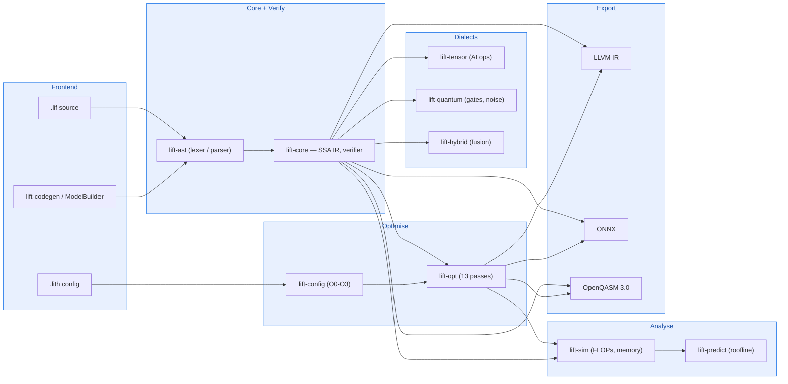
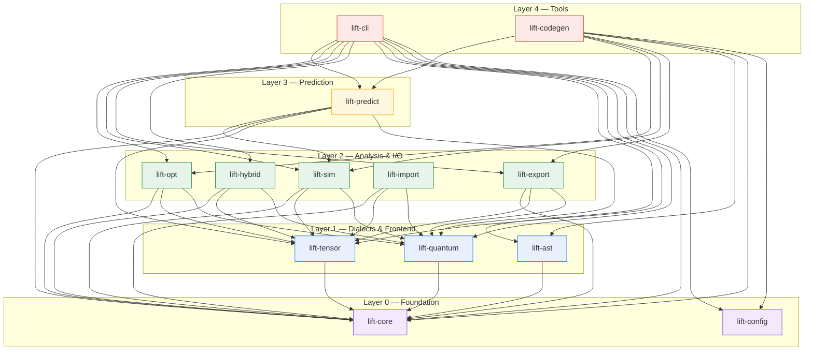
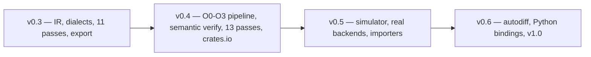

# LIFT — Language for Intelligent Frameworks and Technologies

> **Unified intermediate representation for AI and quantum computing.**

[](LICENSE)
[](https://www.rust-lang.org/)
[](Cargo.toml)
[](https://crates.io/crates/lift-core)
[](https://crates.io/crates/lift-core)
[](https://docs.rs/lift-core)
[](https://github.com/rustnew/Lift/actions/workflows/ci.yml)
[](https://github.com/rustnew/Lift/releases)
[](https://rustnew.github.io/Lift/)

LIFT is a modular compiler framework that provides a single SSA-based intermediate representation spanning **tensor operations** (AI/ML), **quantum gates**, and **classical-quantum hybrid computation**. It enables a unified pipeline: **define → verify → optimise → analyse → predict → export**.

## Why LIFT?

The next decade of computing is **both intelligent and quantum**. AI models run on GPUs;
quantum circuits run on QPUs; and hybrid classical-quantum systems (VQE, QAOA, quantum
chemistry, quantum machine learning) need **both** — but today they live in separate worlds
with separate IRs, separate toolchains, and no way to reason about them together.

LIFT's vision is a **single unified foundation** for AI + quantum computation:

1. **One IR, two worlds** — AI tensors, quantum gates, and their hybrids are equal
   citizens in the same SSA graph. Joint optimisation across classical and quantum
   operations becomes possible.
2. **Noise in the type system** — every quantum gate carries T1/T2, fidelity, and
   crosstalk metadata, so the compiler reasons about noise at every stage — not after
   the fact.
3. **Linear qubit types** — the no-cloning theorem is enforced at compile time. Reusing
   a qubit is a type error, not a runtime crash.
4. **Simulation-first compilation** — FLOPs, peak memory, circuit depth, expected
   fidelity, and energy cost are computed *before* any hardware runs. Budget violations
   halt compilation with actionable suggestions.
5. **One config language** — a single `.lith` file replaces the 6–8 configuration files
   scattered across separate frameworks.

> LIFT — because the future of computation is both intelligent and quantum,
> and it deserves a unified foundation.

## Key Features

- **110 tensor operations** — arithmetic, attention (Flash, Paged, GQA), convolutions, normalisation, quantisation, MoE, GNN, diffusion, and more
- **48 quantum gates** — Pauli, Clifford, parametric, multi-qubit; noise models, Kraus channels, QEC codes
- **21 hybrid operations** — encoding strategies, gradient methods (parameter shift, adjoint), variational algorithms (VQC, VQE, QAOA)
- **13 optimisation passes** — canonicalise, constant folding, DCE, CSE, tensor fusion, FlashAttention replacement, quantisation annotation, gate cancellation, rotation merging, noise-aware scheduling, qubit layout mapping, gate decomposition, real qubit routing
- **3 export backends** — **LLVM IR** (GPU/CPU runtime), **ONNX** (opset 21, PyTorch/TensorFlow/TensorRT interop), **OpenQASM 3.0** (IBM, Rigetti, IonQ, Quantinuum)
- **Optimisation levels `O0`–`O3`** — preset pipelines, explicit-pass override, per-pass enable/disable
- **Semantic verification** — `verify` checks operation arity against dialect signatures (core + tensor + quantum + hybrid)
- **Hardware-native gate decomposition** — H/T/S/Y/RX lowering to provider gate sets (IBM, Rigetti, IonQ, Quantinuum)
- **Real qubit routing** — SWAP insertion with BFS shortest paths over device topologies
- **Generic tensor fusion** — matmul+bias+relu, linear+gelu/silu, conv+bn+relu
- **Non-adjacent gate cancellation & rotation merging** — cancels/merges pairs across commuting gates
- **Programmatic model generation** — `ModelBuilder` API for defining models from Rust code, `lift-codegen` binary for automatic `.lif`/`.lith`/`.ll`/`.onnx`/`.qasm` generation
- **Cost modelling** — roofline analysis, GPU/QPU profiles (A100, H100, IBM, IonQ, etc.), energy/carbon estimation
- **Performance prediction** — compute vs memory bottleneck identification

## Architecture

### Compilation pipeline

The pipeline reads left to right: **Frontend → Core (with semantic verification) → Dialects → Optimise → Analyse → Export**. The 13 optimisation passes are orchestrated by `lift-config` at the Optimise stage.



### Crate dependency graph (by layer)



Each edge `A → B` means "crate A depends on crate B" (verified via
`cargo metadata`). Crates are arranged by **dependency layer** (top to
bottom, `L4` → `L0`): nothing points upward.

### Crates

| Crate | Description |
|-------|-------------|
| **lift-core** | SSA IR, type system, verifier, printer, pass manager, dialect registry, `ModelBuilder` |
| **lift-ast** | Lexer, parser, IR builder for `.lif` source files |
| **lift-tensor** | 110 tensor operations with shape inference and FLOP counting |
| **lift-quantum** | 48 quantum gates, hardware providers, device topology, noise models, Kraus channels, QEC |
| **lift-hybrid** | 21 hybrid ops — encoding, gradient methods, variational algorithms, co-execution |
| **lift-opt** | 13 optimisation passes (classical, quantum, and AI-specific) |
| **lift-sim** | Classical/quantum cost models, energy estimation, reactive budgets, module analysis |
| **lift-predict** | Roofline-based performance prediction |
| **lift-import** | ONNX, PyTorch FX, OpenQASM 3.0 importers |
| **lift-export** | **LLVM IR**, **ONNX** (opset 21), **OpenQASM 3.0** exporters |
| **lift-config** | `.lith` configuration file parser |
| **lift-cli** | Command-line interface (`verify`, `analyse`, `optimise`, `predict`, `export`, `print`) |
| **lift-codegen** | Programmatic model generation binary — define models from Rust, emit all formats |

### Published Crates (v0.4.6)

All LIFT crates are published to [crates.io](https://crates.io):

| Crate | Docs | Downloads |
|-------|------|-----------|
| [lift-core](https://crates.io/crates/lift-core) | [docs.rs](https://docs.rs/lift-core) |  |
| [lift-ast](https://crates.io/crates/lift-ast) | [docs.rs](https://docs.rs/lift-ast) |  |
| [lift-tensor](https://crates.io/crates/lift-tensor) | [docs.rs](https://docs.rs/lift-tensor) |  |
| [lift-quantum](https://crates.io/crates/lift-quantum) | [docs.rs](https://docs.rs/lift-quantum) |  |
| [lift-hybrid](https://crates.io/crates/lift-hybrid) | [docs.rs](https://docs.rs/lift-hybrid) |  |
| [lift-sim](https://crates.io/crates/lift-sim) | [docs.rs](https://docs.rs/lift-sim) |  |
| [lift-predict](https://crates.io/crates/lift-predict) | [docs.rs](https://docs.rs/lift-predict) |  |
| [lift-opt](https://crates.io/crates/lift-opt) | [docs.rs](https://docs.rs/lift-opt) |  |
| [lift-import](https://crates.io/crates/lift-import) | [docs.rs](https://docs.rs/lift-import) |  |
| [lift-export](https://crates.io/crates/lift-export) | [docs.rs](https://docs.rs/lift-export) |  |
| [lift-config](https://crates.io/crates/lift-config) | [docs.rs](https://docs.rs/lift-config) |  |
| [lift-cli](https://crates.io/crates/lift-cli) | [docs.rs](https://docs.rs/lift-cli) |  |
| [lift-codegen](https://crates.io/crates/lift-codegen) | [docs.rs](https://docs.rs/lift-codegen) |  |

## Quick Start

### Prerequisites

- **Rust 1.80+** — install via [rustup](https://rustup.rs/)

### Install the CLI from crates.io

```bash
cargo install lift-cli
```

This installs the `lift` binary with the `verify`, `analyse`, `optimise`,
`predict`, and `export` commands.

### Build from source

```bash
git clone https://github.com/rustnew/Lift.git
cd Lift
cargo build --release
```

### Run the CLI

```bash
# Verify a .lif file
cargo run --release -p lift-cli -- verify examples/phi3_mini.lif

# Analyse
cargo run --release -p lift-cli -- analyse examples/phi3_mini.lif

# Optimise
cargo run --release -p lift-cli -- optimise examples/phi3_mini.lif --config examples/phi3_optimize.lith

# Predict performance
cargo run --release -p lift-cli -- predict examples/phi3_mini.lif --device h100

# Predict performance with energy/CO2 estimate
cargo run --release -p lift-cli -- predict examples/phi3_mini.lif --device h100 --energy

# Predict quantum fidelity, shot count, and execution time
cargo run --release -p lift-cli -- predict examples/quantum_bell.lif --quantum superconducting

# Export to LLVM IR
cargo run --release -p lift-cli -- export examples/phi3_mini.lif --backend llvm --output model.ll

# Export to ONNX
cargo run --release -p lift-cli -- export examples/phi3_mini.lif --backend onnx --output model.onnx

# Export to OpenQASM 3.0
cargo run --release -p lift-cli -- export examples/quantum_bell.lif --backend qasm --output circuit.qasm
```

### Programmatic Model Generation

Define models directly from Rust code and generate all formats with a single command:

```bash
cargo run --bin lift-codegen
```

This generates into `examples/`:
- **4 `.lif` models** — Phi-3-mini, MLP, ResNet block, VQE circuit
- **4 `.ll` files** — LLVM IR exports
- **4 `.onnx` files** — ONNX exports
- **1 `.qasm` file** — OpenQASM export (for quantum models)
- **1 `.lith` config** — H100 optimization configuration

Each model is automatically verified, analysed, optimised, and exported.

### Define Models from Rust

```rust
use lift_core::model_builder::{ModelBuilder, tensor, tensor_2d, DataType};

let model = ModelBuilder::new("my_model")
    .function("forward")
        .param("x", tensor(&[1, 784], DataType::FP32))
        .param("w", tensor_2d(784, 256, DataType::FP32))
        .op("tensor.matmul", &["x", "w"], "h", tensor(&[1, 256], DataType::FP32))
        .op("tensor.relu", &["h"], "out", tensor(&[1, 256], DataType::FP32))
        .returns("out")
        .done();

// Generate .lif source (parseable by lift-cli)
model.write_lif("my_model.lif").unwrap();

// Build IR context for verification/analysis/export
let ctx = model.build_context();
lift_core::verifier::verify(&ctx).unwrap();

// Export to all backends
let llvm_ir = lift_export::LlvmExporter::new().export(&ctx).unwrap();
let onnx_ir = lift_export::OnnxExporter::new().export(&ctx).unwrap();
std::fs::write("my_model.ll", &llvm_ir).unwrap();
std::fs::write("my_model.onnx", &onnx_ir).unwrap();
```

### Use as a Library

```toml
[dependencies]
lift-core    = "0.4.6"
lift-ast     = "0.4.6"
lift-tensor  = "0.4.6"
lift-quantum = "0.4.6"
lift-hybrid  = "0.4.6"
lift-opt     = "0.4.6"
lift-sim     = "0.4.6"
lift-predict = "0.4.6"
lift-import  = "0.4.6"
lift-export  = "0.4.6"
lift-config  = "0.4.6"
```

```rust
use lift_ast::{Lexer, Parser, IrBuilder};
use lift_core::{Context, verifier, pass::PassManager};
use lift_quantum::{Provider, DeviceTopology};

// Parse a .lif file
let source = std::fs::read_to_string("model.lif").unwrap();
let tokens = Lexer::new(&source).tokenize().to_vec();
let program = Parser::new(tokens).parse().unwrap();

let mut ctx = Context::new();
IrBuilder::new().build_program(&mut ctx, &program).unwrap();

// Verify (structural + semantic against dialect signatures)
verifier::verify(&ctx).unwrap();

// Optimise (all 13 passes)
let mut pm = PassManager::new();
pm.add_pass(Box::new(lift_opt::Canonicalize));
pm.add_pass(Box::new(lift_opt::ConstantFolding));
pm.add_pass(Box::new(lift_opt::DeadCodeElimination));
pm.add_pass(Box::new(lift_opt::CommonSubexprElimination));
pm.add_pass(Box::new(lift_opt::TensorFusion));
pm.add_pass(Box::new(lift_opt::FlashAttentionPass::default()));
pm.add_pass(Box::new(lift_opt::QuantisationPass::default()));
pm.add_pass(Box::new(lift_opt::GateCancellation));
pm.add_pass(Box::new(lift_opt::RotationMerge));
pm.add_pass(Box::new(lift_opt::NoiseAwareSchedule));
pm.add_pass(Box::new(lift_opt::LayoutMapping));
pm.add_pass(Box::new(lift_opt::GateDecomposition::new(Provider::IbmKyoto)));
pm.add_pass(Box::new(lift_opt::RealRouting::new(DeviceTopology::linear(8))));
pm.run_all(&mut ctx);

// Export to all 3 backends
let llvm = lift_export::LlvmExporter::new().export(&ctx).unwrap();
let onnx = lift_export::OnnxExporter::new().export(&ctx).unwrap();
let qasm = lift_export::QasmExporter::new().export(&ctx).unwrap();
```

## Export Backends

### LLVM IR

Generates LLVM IR with runtime function calls for all 110 tensor operations (cuBLAS/cuDNN backend):

```bash
lift export model.lif --backend llvm --output model.ll
```

### ONNX

Generates ONNX protobuf text format (opset 21) compatible with PyTorch, TensorFlow, TensorRT, and ONNX Runtime. Supports Microsoft extensions for attention and MoE operations:

```bash
lift export model.lif --backend onnx --output model.onnx
```

**Supported ONNX op mappings:**

| LIFT Operation | ONNX Op | Domain |
|----------------|---------|--------|
| `tensor.matmul` | `MatMul` | standard |
| `tensor.linear` | `Gemm` | standard |
| `tensor.relu` | `Relu` | standard |
| `tensor.gelu` | `Gelu` | standard |
| `tensor.softmax` | `Softmax` | standard |
| `tensor.layernorm` | `LayerNormalization` | standard |
| `tensor.rmsnorm` | `SimplifiedLayerNormalization` | com.microsoft |
| `tensor.conv2d` | `Conv` | standard |
| `tensor.attention` | `Attention` | com.microsoft |
| `tensor.grouped_query_attention` | `GroupQueryAttention` | com.microsoft |
| `tensor.flash_attention` | `MultiHeadAttention` | com.microsoft |
| `tensor.quantize` | `QuantizeLinear` | standard |
| `tensor.dequantize` | `DequantizeLinear` | standard |
| `tensor.moe_dispatch` | `MoE` | com.microsoft |
| + 60 more operations | | |

### OpenQASM 3.0

Generates OpenQASM 3.0 for quantum hardware execution. Supports all 48 gates including IBM, Rigetti, IonQ, and Quantinuum native gate sets:

```bash
lift export quantum.lif --backend qasm --output circuit.qasm
```

## File Formats

| Extension | Description |
|-----------|-------------|
| `.lif` | LIFT IR source code |
| `.lith` | Compilation configuration |
| `.ll` | LLVM IR export |
| `.onnx` | ONNX export (protobuf text) |
| `.qasm` | OpenQASM 3.0 export |

## Examples

See the [`examples/`](examples/) directory:

### Hand-written models
- **`phi3_mini.lif`** — Phi-3-mini transformer
- **`llama2_7b.lif`** — LLaMA-2 7B
- **`mistral_7b.lif`** — Mistral 7B (sliding window attention)
- **`bert_base.lif`** — BERT-base
- **`tensor_mlp.lif`** — Multi-layer perceptron
- **`quantum_bell.lif`** — Bell state preparation

### Generated models (via `cargo run --bin lift-codegen`)
- **`phi3_generated.lif`** — Phi-3-mini (programmatic)
- **`mlp_generated.lif`** — MLP classifier (programmatic)
- **`resnet_generated.lif`** — ResNet block (programmatic)
- **`vqe_generated.lif`** — VQE circuit (programmatic)

### Validation

```bash
bash examples/validate_all.sh   # Full pipeline validation (105 checks)
```

## Documentation

- **📖 [Online book (GitHub Pages)](https://rustnew.github.io/Lift/)** — the full documentation set rendered as a searchable book
- **[LIFT_Guide.md](docs/LIFT_Guide.md)** — Complete feature guide with code examples for every crate
- **[LIFT_Manual.md](docs/LIFT_Manual.md)** — User manual with real-world use cases
- **[LIFT_design.md](docs/LIFT_design.md)** — Architecture and design document
- **[v0.5 Roadmap](docs/ROADMAP-v0.5.md)** — Detailed development plan for the next release
- **[CAPABILITIES.md](docs/CAPABILITIES.md)** — Capabilities, limits, and roadmap
- **[DIALECTS.md](docs/DIALECTS.md)** — Dialect reference (tensor, quantum, hybrid)
- **[STRATEGY.md](docs/STRATEGY.md)** — Business/ROI guide: who uses LIFT and why
- **[CHANGELOG.md](CHANGELOG.md)** — Version history and release notes
- **[PUBLISHING.md](docs/PUBLISHING.md)** — Where LIFT is published and how to promote it
- **[ANNOUNCEMENTS.md](docs/ANNOUNCEMENTS.md)** — Ready-to-post announcement texts for community channels

## Contributing

Contributions are welcome! See [CONTRIBUTING.md](CONTRIBUTING.md) for the
development workflow, project layout, code style, and how to open a pull request.
This project follows a [Code of Conduct](CODE_OF_CONDUCT.md). To report a
security vulnerability, see [SECURITY.md](SECURITY.md).

## Roadmap

LIFT is built in phases. Each phase is released on [crates.io](https://crates.io)
and validated end-to-end (`examples/validate_all.sh`).



### v0.4 (current) — done
- Optimisation pipeline by level (`O0`–`O3`) with explicit-pass override
- Semantic verification (op arity vs dialect signatures)
- 13 optimisation passes: generic tensor fusion, hardware-native gate
  decomposition, real qubit routing (SWAP + BFS), non-adjacent gate
  cancellation & rotation merging
- All 13 crates published to crates.io

### v0.5 — in progress
- **State-vector quantum simulator** (CPU, up to ~25 qubits) — validate
  circuits before deploying to real QPUs
- **Tensor interpreter** — execute tensor ops with real values (numpy-like)
- **Real LLVM IR lowering** with cuBLAS/cuDNN runtime calls
- **Functional importers** — ONNX, PyTorch FX, OpenQASM 3 (currently stubs)
- **SABRE-style dynamic qubit re-placement**

### v0.6 — planned
- **True automatic differentiation** (backward graph construction)
- **PyO3 Python bindings** — use LIFT from Python
- **Multi-file support** (`include` / linking)
- **v1.0 release** — full pipeline, benchmarks, arXiv paper

## License

[MIT](LICENSE)
