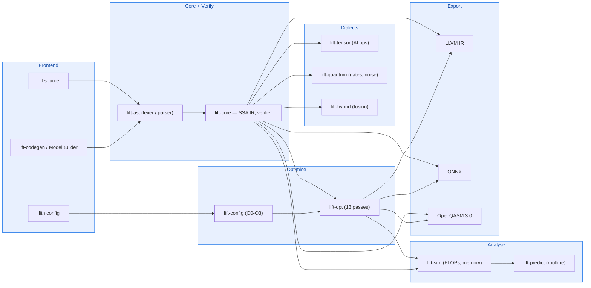
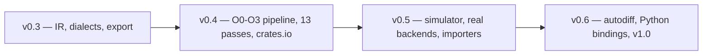

# LIFT — Language for Intelligent Frameworks and Technologies

> **Unified intermediate representation for AI and quantum computing.**

[](LICENSE)
[](https://www.rust-lang.org/)
[](Cargo.toml)
[](https://crates.io/crates/lift-core)
[](https://docs.rs/lift-core)
[](https://github.com/rustnew/Lift/actions/workflows/ci.yml)
[](https://github.com/rustnew/Lift/releases)
[](https://rustnew.github.io/Lift/)

LIFT is a Rust compiler framework built around a single SSA-based
intermediate representation that treats **tensor operations** (AI/ML),
**quantum gates**, and **classical–quantum hybrid computation** as equal
citizens in the same graph. One pipeline handles all three: **define →
verify → optimise → analyse → predict → export**.

## Why LIFT?

AI models run on GPUs, quantum circuits run on QPUs, and hybrid
classical-quantum workloads (VQE, QAOA, quantum machine learning) need both —
but today they live in separate IRs and separate toolchains with no shared
way to reason about them.

1. **One IR, two worlds** — tensors and qubits share one SSA graph, so
   optimisation passes can reason across the classical/quantum boundary.
2. **Noise in the type system** — every quantum gate carries T1/T2,
   fidelity, and crosstalk metadata, so the compiler accounts for noise at
   every stage instead of after the fact.
3. **Linear qubit types** — the no-cloning theorem is enforced at compile
   time; reusing a qubit is a type error, not a runtime crash.
4. **Analysis before hardware runs** — FLOPs, peak memory, circuit depth,
   estimated fidelity, and energy cost are computed statically. Budget
   violations halt compilation with an actionable error.
5. **One config file** — a single `.lith` replaces the several
   configuration files typically scattered across separate frameworks.

## Key Features

- **179 operations** — 110 tensor ops (attention, convolutions, MoE, GNN, quantisation, diffusion), 48 quantum gates (Pauli, Clifford, parametric, IonQ-native), 21 hybrid ops (encoding, gradients, VQC/VQE/QAOA)
- **13 optimisation passes** with preset `O0`–`O3` pipelines, explicit-pass override, and per-pass enable/disable
- **Semantic verification** — SSA, well-formedness, qubit linearity, and operation arity checked against dialect signatures
- **Hardware-native gate decomposition and real qubit routing** — BFS-based SWAP insertion over device topologies, transpilation to IBM/Rigetti/IonQ/Quantinuum native gate sets
- **Non-adjacent gate cancellation, rotation merging, and generic tensor fusion**
- **3 export backends** — LLVM IR, ONNX (opset 21), OpenQASM 3.0 (all 48 gates)
- **Cost modelling and performance prediction** — roofline analysis, GPU/QPU device profiles, energy/carbon estimation
- **Programmatic model generation** — a `ModelBuilder` Rust API and a `lift-codegen` binary for defining models in code

## Architecture

The pipeline reads left to right: **Frontend → Core (with semantic
verification) → Dialects → Optimise → Analyse → Export**.



Full architecture and the crate dependency graph: [docs/LIFT_design.md](docs/LIFT_design.md).

### Crates

All 13 are published to [crates.io](https://crates.io) and versioned together.

| Crate | Description |
|-------|-------------|
| [`lift-core`](https://crates.io/crates/lift-core) | SSA IR, type system, verifier, printer, pass manager, `ModelBuilder` |
| [`lift-ast`](https://crates.io/crates/lift-ast) | Lexer, parser, IR builder for `.lif` source files |
| [`lift-tensor`](https://crates.io/crates/lift-tensor) | 110 tensor operations with shape inference and FLOP counting |
| [`lift-quantum`](https://crates.io/crates/lift-quantum) | 48 quantum gates, hardware providers, topology, noise, QEC |
| [`lift-hybrid`](https://crates.io/crates/lift-hybrid) | 21 hybrid ops — encoding, gradients, variational algorithms |
| [`lift-opt`](https://crates.io/crates/lift-opt) | 13 optimisation passes (classical, quantum, AI-specific) |
| [`lift-sim`](https://crates.io/crates/lift-sim) | Cost models, energy estimation, reactive budgets |
| [`lift-predict`](https://crates.io/crates/lift-predict) | Roofline-based performance prediction |
| [`lift-import`](https://crates.io/crates/lift-import) | ONNX, PyTorch FX, OpenQASM 3.0 importers |
| [`lift-export`](https://crates.io/crates/lift-export) | LLVM IR, ONNX, OpenQASM 3.0 exporters |
| [`lift-config`](https://crates.io/crates/lift-config) | `.lith` configuration file parser |
| [`lift-cli`](https://crates.io/crates/lift-cli) | Command-line interface (installs as `lift`) |
| [`lift-codegen`](https://crates.io/crates/lift-codegen) | Programmatic model generation binary |

Docs for any crate: `https://docs.rs/<crate-name>`.

## Quick Start

**Requires Rust 1.80+** ([rustup](https://rustup.rs/)).

```bash
cargo install lift-cli   # installs the `lift` binary
```

```bash
lift verify examples/phi3_mini.lif
lift analyse examples/phi3_mini.lif
lift optimise examples/phi3_mini.lif --config examples/phi3_optimize.lith
lift predict examples/phi3_mini.lif --device h100 --energy
lift predict examples/quantum_bell.lif --quantum superconducting
lift export examples/phi3_mini.lif --backend onnx --output model.onnx
```

Building from source instead: `git clone` this repo, then `cargo build
--release` and substitute `cargo run --release -p lift-cli --` for `lift`
above.

### As a library

```toml
[dependencies]
lift-core    = "0.4.6"
lift-ast     = "0.4.6"
lift-opt     = "0.4.6"
lift-export  = "0.4.6"
```

```rust
use lift_ast::{Lexer, Parser, IrBuilder};
use lift_core::{Context, verifier, pass::PassManager};

let source = std::fs::read_to_string("model.lif").unwrap();
let tokens = Lexer::new(&source).tokenize().to_vec();
let program = Parser::new(tokens).parse().unwrap();

let mut ctx = Context::new();
IrBuilder::new().build_program(&mut ctx, &program).unwrap();
verifier::verify(&ctx).unwrap();

let mut pm = PassManager::new();
pm.add_pass(Box::new(lift_opt::Canonicalize));
pm.add_pass(Box::new(lift_opt::TensorFusion));
// ... 13 passes total — see docs/LIFT_Guide.md for the full pipeline
pm.run_all(&mut ctx);

let onnx = lift_export::OnnxExporter::new().export(&ctx).unwrap();
```

Defining models programmatically instead of writing `.lif` by hand: see
`ModelBuilder` in [docs/LIFT_Guide.md](docs/LIFT_Guide.md) or run `cargo run
--bin lift-codegen` for a working end-to-end example.

## Export Backends

- **LLVM IR** — `--backend llvm`. Emits IR with cuBLAS/cuDNN runtime call
  sites for all 110 tensor operations. Currently textual (not yet
  executable) — see [docs/CAPABILITIES.md](docs/CAPABILITIES.md).
- **ONNX** — `--backend onnx`. Protobuf text, opset 21, 70+ operations
  mapped to standard ONNX and `com.microsoft` extensions (attention, MoE).
  Full op-mapping table in [docs/LIFT_Guide.md](docs/LIFT_Guide.md).
- **OpenQASM 3.0** — `--backend qasm`. All 48 gates, targeting IBM,
  Rigetti, IonQ, and Quantinuum native gate sets.

| Extension | Description |
|-----------|-------------|
| `.lif` | LIFT IR source code |
| `.lith` | Compilation configuration |
| `.ll` | LLVM IR export |
| `.onnx` | ONNX export (protobuf text) |
| `.qasm` | OpenQASM 3.0 export |

## Examples

See [`examples/`](examples/) — hand-written models (`phi3_mini.lif`,
`llama2_7b.lif`, `mistral_7b.lif`, `bert_base.lif`, `quantum_bell.lif`) and
programmatically generated ones (`cargo run --bin lift-codegen`). Validate
the full pipeline end-to-end:

```bash
bash examples/validate_all.sh   # 105 checks across every example and backend
```

## Documentation

- **📖 [Online book](https://rustnew.github.io/Lift/)** — the full documentation set, searchable
- [LIFT_Guide.md](docs/LIFT_Guide.md) — feature guide with code examples for every crate
- [LIFT_Manual.md](docs/LIFT_Manual.md) — user manual with real-world use cases
- [LIFT_design.md](docs/LIFT_design.md) — architecture and design
- [DIALECTS.md](docs/DIALECTS.md) — full dialect reference (tensor, quantum, hybrid)
- [CAPABILITIES.md](docs/CAPABILITIES.md) — honest capabilities, limits, and roadmap
- [STRATEGY.md](docs/STRATEGY.md) — who uses LIFT and why
- [CHANGELOG.md](CHANGELOG.md) — version history

## Contributing

Contributions are welcome — see [CONTRIBUTING.md](CONTRIBUTING.md) for the
development workflow and PR process. This project follows a
[Code of Conduct](CODE_OF_CONDUCT.md); see [SECURITY.md](SECURITY.md) to
report a vulnerability.

## Roadmap



**v0.4 (current)** — optimisation pipeline with `O0`–`O3` levels, semantic
verification, 13 passes, all crates on crates.io.

**v0.5 (next)** — state-vector quantum simulator, tensor interpreter, real
LLVM lowering with cuBLAS/cuDNN calls, functional ONNX/PyTorch FX/OpenQASM
importers, SABRE-style dynamic qubit re-placement.

**v0.6** — automatic differentiation, PyO3 Python bindings, multi-file
support, v1.0 release.

Details: [docs/ROADMAP-v0.5.md](docs/ROADMAP-v0.5.md).

## License

[MIT](LICENSE)
