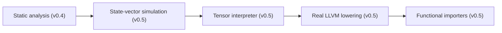

# LIFT v0.5 — Development Plan

> **Status**: Active development target
> **Scope**: Execution engine, functional importers, real LLVM lowering
> **Version bump**: 0.5.0 (minor — new features, no breaking IR changes)

This plan breaks down the v0.5 milestone into concrete, independently
mergeable work items. Each item lists the crates and files involved, the
deliverable, and the acceptance criteria.

---

## Overview

v0.5 moves LIFT from a *static analysis* compiler to an *execution-capable*
compiler:



The four work streams are independent and can be developed in parallel.

---

## Workstream 1 — State-vector quantum simulator

**Target**: simulate quantum circuits on CPU (up to ~25 qubits) to validate
circuits before deploying to real QPUs.

**Status today**: `crates/lift-sim/src/quantum_sim.rs` performs *static*
analysis only (gate counts, depth, fidelity estimates). There is no numerical
simulation.

### Tasks

| # | Task | File(s) | Acceptance |
|---|------|---------|------------|
| 1.1 | Amplitude vector type `Vec<Complex64>` with 2^N layout | `crates/lift-sim/src/state.rs` | `State::new(num_qubits)` allocates 2^N amplitudes |
| 1.2 | Gate matrix kernels (Pauli, Clifford, H, T, RX/RY/RZ, CNOT, SWAP) | `crates/lift-sim/src/kernels.rs` | Each gate applies correctly to an amplitude vector |
| 1.3 | Circuit executor — walk LIFT IR ops, apply gates in order | `crates/lift-sim/src/executor.rs` | Executes any quantum circuit expressed in `lift-quantum` dialect |
| 1.4 | Measurement with probability sampling | `crates/lift-sim/src/measure.rs` | `measure(qubit)` collapses state per Born rule |
| 1.5 | Noise channel application (depolarising, amplitude damping) | `crates/lift-sim/src/noise.rs` | Kraus operators applied to density matrix (mixed state mode) |
| 1.6 | CLI subcommand `lift sim --quantum file.lif` | `crates/lift-cli/src/main.rs` | Prints final state amplitudes + measurement counts |

### Deliverable

`lift sim --quantum examples/quantum_bell.lif` prints:

```
Qubits: 2
State:  |00⟩: 0.7071  |11⟩: 0.7071
Measurements (1024 shots): 00: 512, 11: 512
```

---

## Workstream 2 — Tensor interpreter

**Target**: execute tensor ops with real values (numpy-like), enabling
in-compiler evaluation of constant subgraphs.

**Status today**: no runtime values; the IR holds shapes/types only.

### Tasks

| # | Task | File(s) | Acceptance |
|---|------|---------|------------|
| 2.1 | Runtime tensor value `Tensor { data: Vec<f64>, shape: Vec<usize> }` | `crates/lift-sim/src/tensor.rs` | Basic constructors and indexing |
| 2.2 | Core arithmetic kernels — add, sub, mul, div, matmul, broadcast | `crates/lift-sim/src/tensor_ops.rs` | Matches numpy semantics on shape mismatch |
| 2.3 | Reduction + reshape ops — sum, mean, max, reshape, transpose | `crates/lift-sim/src/tensor_ops.rs` | Correct output shapes |
| 2.4 | Dialect op → kernel dispatcher | `crates/lift-sim/src/interp.rs` | Every `lift-tensor` op maps to a kernel or errors clearly |
| 2.5 | CLI subcommand `lift sim --tensor file.lif` | `crates/lift-cli/src/main.rs` | Prints output tensors |

### Deliverable

`lift sim --tensor examples/tensor_mlp.lif` evaluates the MLP forward pass and
prints each layer's output tensor.

---

## Workstream 3 — Real LLVM IR lowering

**Target**: emit executable LLVM IR with cuBLAS/cuDNN runtime calls (GPU) and
a fallback CPU path.

**Status today**: `lift-export/src/llvm.rs` emits a *textual skeleton* — module
declarations and function signatures, without real code generation.

### Tasks

| # | Task | File(s) | Acceptance |
|---|------|---------|------------|
| 3.1 | Map LIFT tensor ops to cuBLAS calls (gemm, bias, relu fusion) | `crates/lift-export/src/llvm.rs` | `matmul` emits `cublasSgemm` |
| 3.2 | Map quantum measurement/shots to a runtime harness | `crates/lift-export/src/llvm.rs` | QPU bridge stubs generated |
| 3.3 | CPU fallback path (no GPU required to run) | `crates/lift-export/src/llvm.rs` | Emitted `.ll` compiles with `clang` |
| 3.4 | Verify emitted IR with `llvm-as` / `lli` in CI | `.github/workflows/ci.yml` | `lli` executes a trivial kernel |

### Deliverable

`lift export --backend llvm examples/phi3_mini.lif` produces an `.ll` file that
compiles with `clang` and runs on CPU without a GPU.

---

## Workstream 4 — Functional importers

**Target**: import ONNX, PyTorch FX, and OpenQASM 3 files into LIFT IR.

**Status today**: `crates/lift-import/src/{onnx,pytorch,qasm}.rs` are stubs —
error types and importer structs exist, but no parsing.

### Tasks

| # | Task | File(s) | Acceptance |
|---|------|---------|------------|
| 4.1 | ONNX protobuf decoding (opset ≤ 21) | `crates/lift-import/src/onnx.rs` | Loads a real `.onnx` from `examples/` |
| 4.2 | ONNX op → LIFT tensor op mapping | `crates/lift-import/src/onnx.rs` | Conv, Gemm, Relu, Softmax map correctly |
| 4.3 | OpenQASM 3 parser (grammar subset) | `crates/lift-import/src/qasm.rs` | Parses `quantum_bell.lif`-equivalent QASM |
| 4.4 | QASM gate → LIFT quantum op mapping | `crates/lift-import/src/qasm.rs` | H, CNOT, measure round-trip |
| 4.5 | PyTorch FX graph export ingestion | `crates/lift-import/src/pytorch.rs` | Reads a `.fx.json` graph |
| 4.6 | CLI subcommand `lift import <file>` | `crates/lift-cli/src/main.rs` | Imports and prints the IR |

### Deliverable

`lift import examples/phi3_generated.onnx` produces a valid LIFT IR that passes
`lift verify`.

---

## Testing strategy

- Every new kernel/simulator function gets unit tests in-crate.
- Round-trip tests: export `.qasm`/`.onnx` → import → verify.
- `examples/validate_all.sh` extended with `sim` and `import` steps.
- CI keeps `cargo fmt --check`, `clippy -D warnings`, `cargo test --workspace`.

---

## Suggested PR sequence

1. `feat(sim): state-vector simulator` — Workstream 1 (items 1.1–1.5)
2. `feat(cli): sim subcommands` — items 1.6 + 2.5
3. `feat(sim): tensor interpreter` — Workstream 2 (2.1–2.4)
4. `feat(import): ONNX importer` — Workstream 4 (4.1–4.2)
5. `feat(import): OpenQASM importer` — Workstream 4 (4.3–4.4)
6. `feat(export): real LLVM lowering` — Workstream 3
7. `feat(import): PyTorch FX` — Workstream 4 (4.5–4.6)

Each PR is independently mergeable and keeps `main` green.
